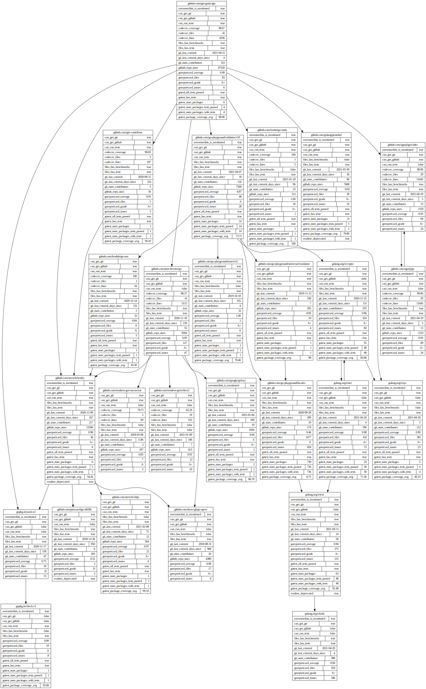
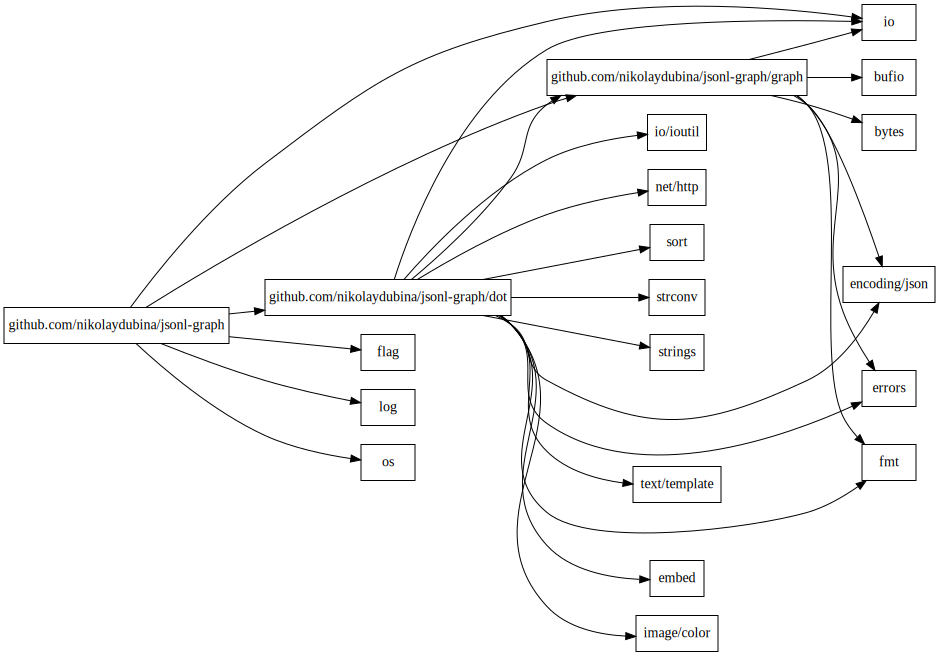

# JSONL Graph Tools

> Convenient to use with `jq`

[](https://pkg.go.dev/github.com/nikolaydubina/jsonl-graph)
[](https://goreportcard.com/report/github.com/nikolaydubina/jsonl-graph)
[](https://codecov.io/gh/nikolaydubina/jsonl-graph)
[](https://github.com/nikolaydubina/jsonl-graph/actions)
[](https://github.com/avelino/awesome-go#science-and-data-analysis)

```bash
$ go install github.com/nikolaydubina/jsonl-graph@latest
```

Self contained graph renderer.
This can be an alternative to Graphviz, however it supports it as an output target too.

Graph is represented as JSONL of nodes and edges.

Node has `id` and any fields:
```
{
    "id": "github.com/gin-gonic/gin",
    "can_get_github": true,
    "github_url": "https://github.com/gin-gonic/gin",
    "git_last_commit": "2021-04-21",
    "git_num_contributors": 321,
    ...
}
```

Edge has `from` and `to` of node `id`:
```json
{
    "from": "github.com/gin-gonic/gin",
    "to": "golang.org/x/tools"
}
```

Why [JSONL](https://jsonlines.org/)? It is a perfect fit for storing graphs:
- can append new nodes and edges by concatenating files
- nodes and edges can have any data
- schema-less
- any subset of lines is a valid graph

## Examples

Website TODO: link here

TODO: screenshot here

To illustrate, I am using data from [import-graph](github.com/nikolaydubina/import-graph). 

[Graphviz](https://graphviz.org/download/) renderer also supported. If you pass color scheme, then values will be colored.
```bash
$ cat '
{"id":"github.com/gin-gonic/gin","can_get_git":true, ... }
{"id":"github.com/gin-contrib/sse","can_get_git":true,"can_run_tests":true ... }
...
{"from":"github.com/gin-gonic/gin","to":"golang.org/x/tools"}
{"from":"github.com/gin-gonic/gin","to":"github.com/go-playground/validator/v10"}
' | jsonl-graph -color-scheme=file://$PWD/docs/colors.json | dot -Tsvg > colored.svg
```


By default, no coloring is applied.
```bash
$ cat '
{"id":"github.com/gin-gonic/gin","can_get_git":true, ... }
{"id":"github.com/gin-contrib/sse","can_get_git":true,"can_run_tests":true ... }
...
{"from":"github.com/gin-gonic/gin","to":"golang.org/x/tools"}
{"from":"github.com/gin-gonic/gin","to":"github.com/go-playground/validator/v10"}
' | jsonl-graph | dot -Tsvg > basic.svg
```


If nodes have less fields, then adjusting graph

```bash
$ cat '
{"from":"github.com/nikolaydubina/jsonl-graph/graph","to":"bufio"}
{"from":"github.com/nikolaydubina/jsonl-graph/graph","to":"bytes"}
{"from":"github.com/nikolaydubina/jsonl-graph/graph","to":"encoding/json"}
{"from":"github.com/nikolaydubina/jsonl-graph/graph","to":"errors"}
{"from":"github.com/nikolaydubina/jsonl-graph/graph","to":"fmt"}
...
' | jsonl-graph | dot -Tsvg > small.svg
```



## TODO

- [ ] coloring of nodes contents
- [ ] Put center of mass at center of browser on startup
- [ ] node location algorithm
- [ ] edge location algorithm
- [ ] subway map style edges ports in nodes and layout
- [ ] flexible path edges
- [ ] UI for coloring input
- [ ] update graph without re-rendering whole
- [ ] Touch for zoom and pan
- [ ] Stable render graph update on large changes (e.g. "one deleted node does not shift everything")
- [ ] Fetch single json from URL
- [ ] Fetch single field from URL
- [ ] Fetch multiple JSONL from URL

## References

- Magnetic Spring graph drawing, Kozo Sugiyama
- [Layered Graph](https://en.wikipedia.org/wiki/Layered_graph_drawing)
- [google/pprof svg](https://github.com/google/pprof/blob/master/internal/driver/svg.go)
- [google/pprof svgpan](https://github.com/google/pprof/blob/master/third_party/svgpan/svgpan.go)