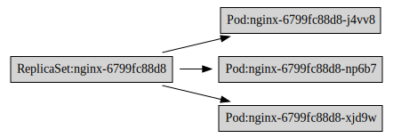
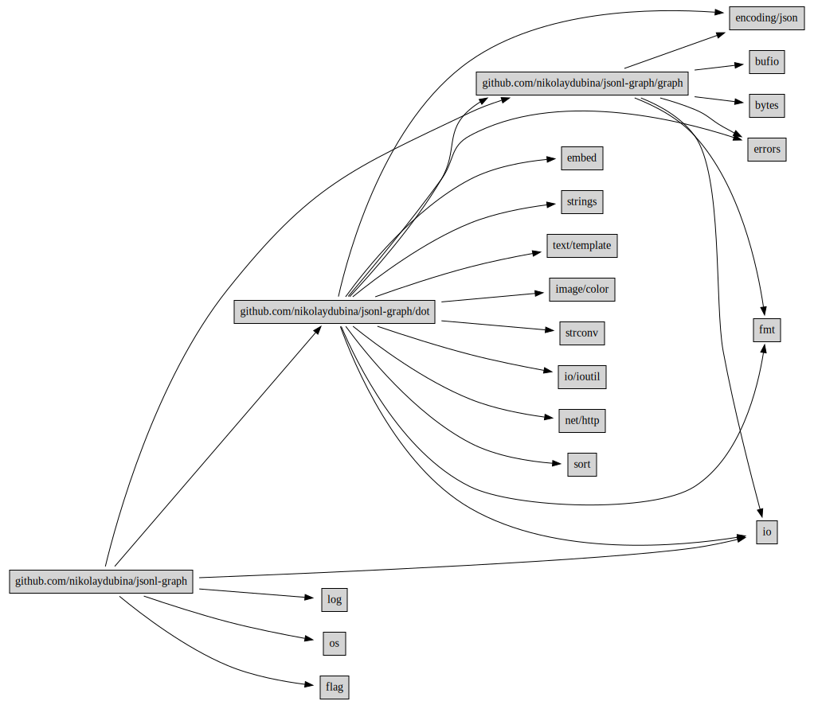

# JSONL Graph Tools

> Convenient to use with `jq`

[](https://pkg.go.dev/github.com/nikolaydubina/jsonl-graph)
[](https://goreportcard.com/report/github.com/nikolaydubina/jsonl-graph)
[](https://codecov.io/gh/nikolaydubina/jsonl-graph)
[](https://github.com/nikolaydubina/jsonl-graph/actions)
[](https://github.com/avelino/awesome-go#science-and-data-analysis)

```
# get https://graphviz.org/download/ 
$ go install github.com/nikolaydubina/jsonl-graph@latest
```

What is JSONL graph? Node has `id`. Edge has `from` and `to`.
```
{
    "id": "github.com/gin-gonic/gin",
    "can_get_github": true,
    "github_url": "https://github.com/gin-gonic/gin",
    "git_last_commit": "2021-04-21",
    "git_num_contributors": 321,
    ...
}
...
{
    "from": "github.com/gin-gonic/gin",
    "to": "golang.org/x/tools",
    ...
}
```

## Examples

Kubernetes Pod Owners

```bash
$ kubectl get pods -o json | jq '.items[] | {to: (.kind + ":" + .metadata.name), from: (.metadata.ownerReferences[].kind + ":" + .metadata.ownerReferences[].name)}' | ./jsonl-graph | dot -Tsvg > k8s_pod_owners.svg
```



Large nodes and color scheme
```bash
$ cat '
{"id":"github.com/gin-gonic/gin","can_get_git":true, ... }
{"id":"github.com/gin-contrib/sse","can_get_git":true,"can_run_tests":true ... }
...
{"from":"github.com/gin-gonic/gin","to":"golang.org/x/tools"}
{"from":"github.com/gin-gonic/gin","to":"github.com/go-playground/validator/v10"}
' | jsonl-graph -color-scheme=file://$PWD/testdata/colors.json | dot -Tsvg > colored.svg
```


Small nodes or only edges
```bash
$ cat '
{"from":"github.com/nikolaydubina/jsonl-graph/graph","to":"bufio"}
{"from":"github.com/nikolaydubina/jsonl-graph/graph","to":"bytes"}
{"from":"github.com/nikolaydubina/jsonl-graph/graph","to":"encoding/json"}
{"from":"github.com/nikolaydubina/jsonl-graph/graph","to":"errors"}
{"from":"github.com/nikolaydubina/jsonl-graph/graph","to":"fmt"}
...
' | jsonl-graph | dot -Tsvg > small.svg
```



## Rendering

Currently only Graphviz is supported.
Follow progress of native Go graph rendering in [github.com/nikolaydubina/go-graph-layout](https://github.com/nikolaydubina/go-graph-layout). Once it is ready, it will be integrated into this project.