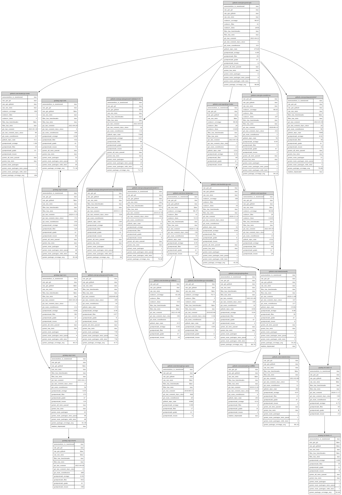

# [JSONL-Graph](https://example.com) Tools

> SVG/Graphviz graph renderer tailored for WebAssembly, CLI and `jq`

[](https://pkg.go.dev/github.com/nikolaydubina/jsonl-graph)
[](https://goreportcard.com/report/github.com/nikolaydubina/jsonl-graph)
[](https://codecov.io/gh/nikolaydubina/jsonl-graph)
[](https://github.com/nikolaydubina/jsonl-graph/actions)
[](https://github.com/avelino/awesome-go#science-and-data-analysis)

```bash
$ go install github.com/nikolaydubina/jsonl-graph@latest
```

What is JSONL graph? Node has `id`. Edge has `from` and `to`.
```
{
    "id": "github.com/gin-gonic/gin",
    "can_get_github": true,
    "github_url": "https://github.com/gin-gonic/gin",
    "git_last_commit": "2021-04-21",
    "git_num_contributors": 321,
    ...
}
...
{
    "from": "github.com/gin-gonic/gin",
    "to": "golang.org/x/tools",
    ...
}
```

## Features

✅ Schema-less  
✅ SVG, Graphviz  
✅ Coloring  
⏳ Metro-style edges  
✅ Gravity, Spring force (Magnetic force coming next)    
✅ Isomap, Eades  
✅ Kozo Sugiyama layers  
✅ Brandes-Köpf horizontal layers assignment  
✅ 100% Go, no JS, no `cgo`, 100% offline, minimal dependencies  

## WebAssembly

TODO: link here
TODO: screenshot here

## CLI

K8S example

TODO:

To illustrate, I am using data from [import-graph](github.com/nikolaydubina/import-graph). 

[Graphviz](https://graphviz.org/download/) renderer also supported. If you pass color scheme, then values will be colored.
```bash
$ cat '
{"id":"github.com/gin-gonic/gin","can_get_git":true, ... }
{"id":"github.com/gin-contrib/sse","can_get_git":true,"can_run_tests":true ... }
...
{"from":"github.com/gin-gonic/gin","to":"golang.org/x/tools"}
{"from":"github.com/gin-gonic/gin","to":"github.com/go-playground/validator/v10"}
' | jsonl-graph -color-scheme=file://$PWD/testdata/colors.json | dot -Tsvg > colored.svg
```


By default, no coloring is applied.
```bash
$ cat '
{"id":"github.com/gin-gonic/gin","can_get_git":true, ... }
{"id":"github.com/gin-contrib/sse","can_get_git":true,"can_run_tests":true ... }
...
{"from":"github.com/gin-gonic/gin","to":"golang.org/x/tools"}
{"from":"github.com/gin-gonic/gin","to":"github.com/go-playground/validator/v10"}
' | jsonl-graph | dot -Tsvg > basic.svg
```


If nodes have less fields, then adjusting graph

```bash
$ cat '
{"from":"github.com/nikolaydubina/jsonl-graph/graph","to":"bufio"}
{"from":"github.com/nikolaydubina/jsonl-graph/graph","to":"bytes"}
{"from":"github.com/nikolaydubina/jsonl-graph/graph","to":"encoding/json"}
{"from":"github.com/nikolaydubina/jsonl-graph/graph","to":"errors"}
{"from":"github.com/nikolaydubina/jsonl-graph/graph","to":"fmt"}
...
' | jsonl-graph | dot -Tsvg > small.svg
```


## Missing Features?

Contributions welcomed! 🙌🏻

## References

- [Graph Drawing](https://en.wikipedia.org/wiki/Graph_drawing)
- [google/pprof svg](https://github.com/google/pprof/blob/master/internal/driver/svg.go)
- [google/pprof svgpan](https://github.com/google/pprof/blob/master/third_party/svgpan/svgpan.go)
- [Graph Compact Orthogonal Layout Algorithm](https://arxiv.org/pdf/1807.09368.pdf)
- [Coffman-Graham algorithm](https://en.wikipedia.org/wiki/Coffman–Graham_algorithm)
- [gonum isomap layout](https://github.com/gonum/gonum/blob/master/graph/layout/isomap.go)
- [gonum eades layout](https://github.com/gonum/gonum/blob/master/graph/layout/eades.go)
- [Booststrap](https://getbootstrap.com)
- [Go WebAssembly](https://github.com/golang/go/wiki/WebAssembly#debugging)
- [Layered Graph](https://en.wikipedia.org/wiki/Layered_graph_drawing)
- Fruchterman & Reingold forces
- Lombarding-Spring-Embedder (Chernobleskiy, 2012)
- Realistic Node Sizes (Gasner, North 1998)
- [Minsky's Theorem](https://en.wikipedia.org/wiki/Mirsky%27s_theorem)
- Magnetic Spring graph drawing, Kozo Sugiyama
- [Handbook of Graph Drawing and Visualization](https://cs.brown.edu/people/rtamassi/gdhandbook/), Roberto Tamassia, Brown, Ch.13
- [Fast and Simple Horizontal Coordinate Assignment](https://link.springer.com/content/pdf/10.1007/3-540-45848-4_3.pdf), U. Brandes, Boris Köpf