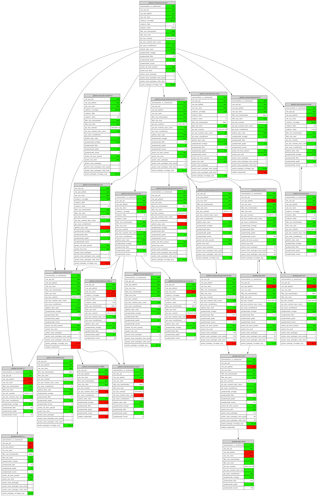

# [JSONL-Graph](https://example.com) Tools

> SVG/Graphviz graph renderer for WebAssembly, CLI and `jq`

[](https://pkg.go.dev/github.com/nikolaydubina/jsonl-graph)
[](https://goreportcard.com/report/github.com/nikolaydubina/jsonl-graph)
[](https://codecov.io/gh/nikolaydubina/jsonl-graph)
[](https://github.com/nikolaydubina/jsonl-graph/actions)
[](https://github.com/avelino/awesome-go#science-and-data-analysis)

```bash
$ go install github.com/nikolaydubina/jsonl-graph@latest
```

What is JSONL graph? Node has `id`. Edge has `from` and `to`.
```
{
    "id": "github.com/gin-gonic/gin",
    "can_get_github": true,
    "github_url": "https://github.com/gin-gonic/gin",
    "git_last_commit": "2021-04-21",
    "git_num_contributors": 321,
    ...
}
...
{
    "from": "github.com/gin-gonic/gin",
    "to": "golang.org/x/tools",
    ...
}
```

## Features

✅ Schema-less  
✅ SVG, Graphviz  
✅ Coloring  
⏳ Metro-style edges  
✅ Gravity, Spring force  
✅ Isomap, Eades  
✅ Kozo Sugiyama layers  
✅ Brandes-Köpf horizontal layers assignment  
✅ 100% Go, no JS, no `cgo`, 100% offline, minimal dependencies  

## Examples

TODO: K8S example

Graphviz with lots nodes having lots of fields and color scheme
```bash
$ cat '
{"id":"github.com/gin-gonic/gin","can_get_git":true, ... }
{"id":"github.com/gin-contrib/sse","can_get_git":true,"can_run_tests":true ... }
...
{"from":"github.com/gin-gonic/gin","to":"golang.org/x/tools"}
{"from":"github.com/gin-gonic/gin","to":"github.com/go-playground/validator/v10"}
' | jsonl-graph -color-scheme=file://$PWD/testdata/colors.json | dot -Tsvg > colored.svg
```


Graphviz when nodes have no fields
```bash
$ cat '
{"from":"github.com/nikolaydubina/jsonl-graph/graph","to":"bufio"}
{"from":"github.com/nikolaydubina/jsonl-graph/graph","to":"bytes"}
{"from":"github.com/nikolaydubina/jsonl-graph/graph","to":"encoding/json"}
{"from":"github.com/nikolaydubina/jsonl-graph/graph","to":"errors"}
{"from":"github.com/nikolaydubina/jsonl-graph/graph","to":"fmt"}
...
' | jsonl-graph | dot -Tsvg > small.svg
```


## Contributions

...are welcomed! 🙌🏻

## References

- [Wiki Layered Graph Drawing](https://en.wikipedia.org/wiki/Layered_graph_drawing)
- ["Handbook of Graph Drawing and Visualization"](https://cs.brown.edu/people/rtamassi/gdhandbook/), Roberto Tamassia, Brown, Ch.13
- ["Fast and Simple Horizontal Coordinate Assignment"](https://link.springer.com/content/pdf/10.1007/3-540-45848-4_3.pdf), U. Brandes, Boris Köpf
- "Methods for visual understanding of hierarchical system structures", Sugiyama, Kozo; Tagawa, Shôjirô; Toda, Mitsuhiko, 1981
- "Graph Drawing by the Magnetic Spring Model", Kozo Sugiyama, 1995
- ["A Technique for Drawing Directed Graphs"](https://ieeexplore.ieee.org/document/221135), Emden R. Gansner Eleftherios Koutsofios Stephen C. North Kiem-Phong Vo, AT&T Bell Laboratories, 1993
